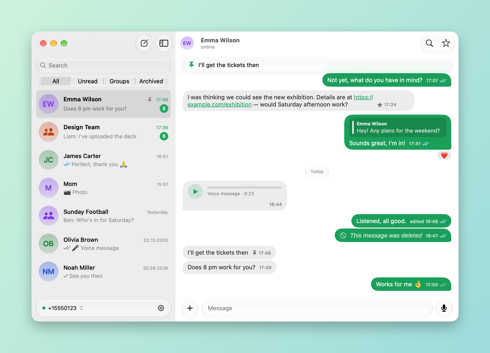
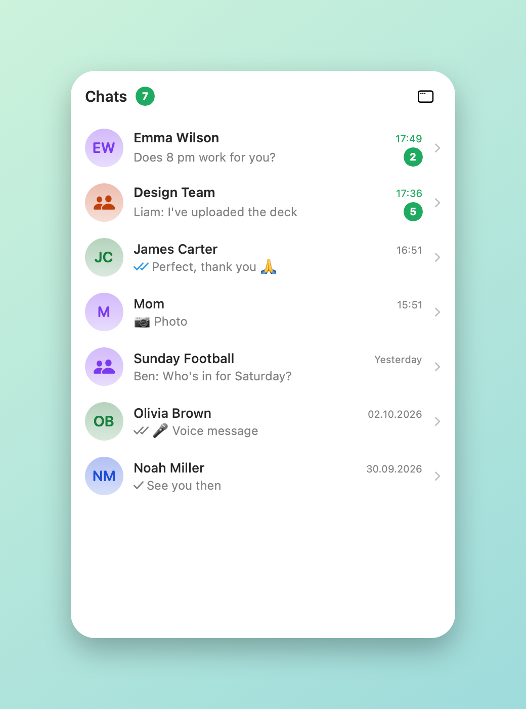
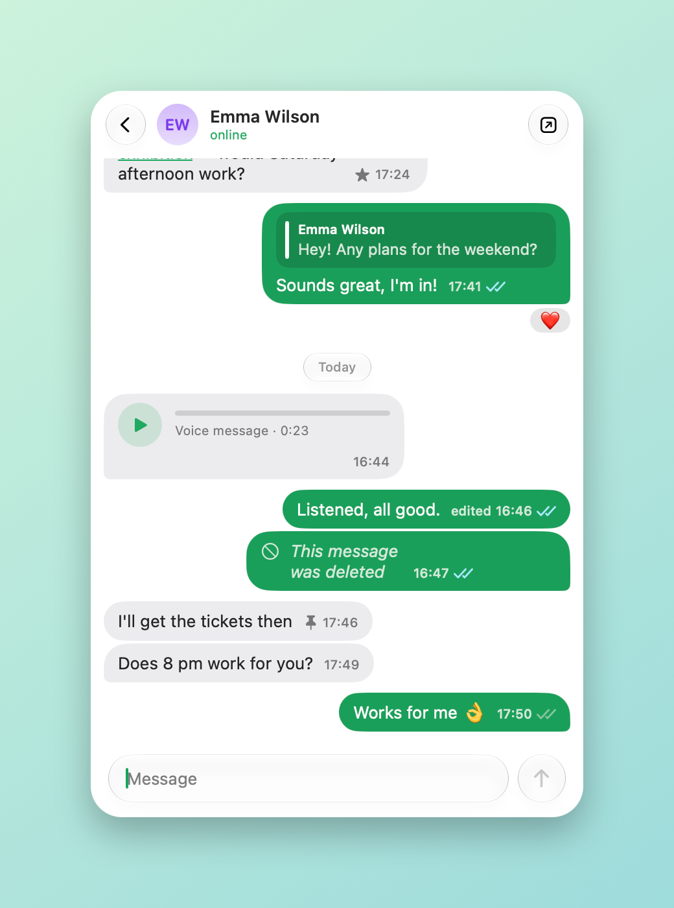
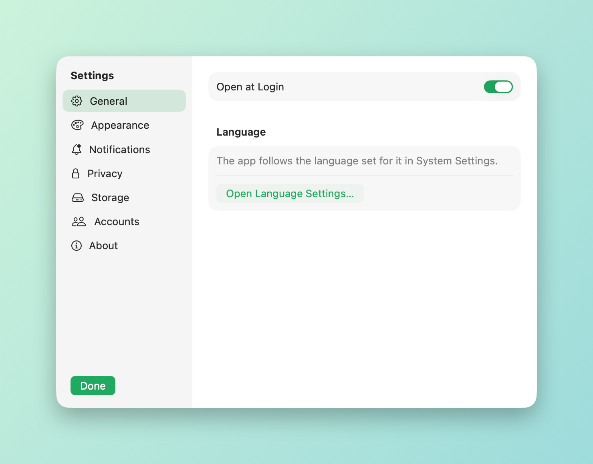

# WhatsApp Zen

A small, native macOS client for WhatsApp: a SwiftUI/AppKit interface on top of
the [whatsmeow](https://github.com/tulir/whatsmeow) protocol library. It links
to your account as a companion device (like WhatsApp Web) and uses a fraction
of the memory of the official app.



| Menu bar: recent chats | Menu bar: reply in place | Settings |
| --- | --- | --- |
|  |  |  |

> **Unofficial.** This project is not affiliated with, endorsed by, or
> connected to WhatsApp or Meta. Third-party clients are against WhatsApp's
> Terms of Service and using one may get your account restricted or banned.
> Use it at your own risk. "WhatsApp" and its logo are trademarks of
> WhatsApp LLC.

## Features

- Chats and groups: text, photos, videos, documents, voice messages (record
  and play), stickers, replies, reactions, edit and delete-for-everyone
- Read receipts, typing indicator, online / last seen, profile photos
- Paste or drag-and-drop photos and files to send them
- Pin and archive chats; star, pin and forward messages; search inside a chat
- Group management: members, admins, rename, invite link, leave
- A menu bar panel with your recent chats that you can read and answer from
  without opening the app
- Notifications with inline reply
- Multiple accounts
- Updates itself from GitHub releases (each download is checked against the
  developer signature before it is installed)
- English, Turkish, Russian, French, German, Spanish, Portuguese and Italian;
  follows the system (or per-app) language

Not supported: voice and video calls (the protocol library does not implement
call media; incoming calls are shown as a notification), status updates,
communities and channels.

## Install

Requires macOS 26 or later on Apple silicon.

```bash
brew install --cask mdenizay/tap/whatsapp-zen
```

The app is signed and notarized, so it opens like any other.

Then open the app and scan the QR code from WhatsApp on your phone
(Settings → Linked Devices → Link a Device).

## Build from source

You need Xcode 26 or later (or its Command Line Tools) and Go.

```bash
brew install go
./build.sh
open "dist/WhatsApp Zen.app"
```

## How it is put together

| Part | What it is |
| --- | --- |
| `core/` | Go. Wraps whatsmeow, keeps chats and messages in SQLite, and is built as a C static library. Its whole surface is `WAStart`, `WACall` (JSON command in, JSON reply out) and an event callback. |
| `app/` | Swift. The SwiftUI/AppKit interface, linked against the core. |
| `tools/` | The script that draws the app icon. |

Data lives in `~/Library/Application Support/WhatsAppZen/`, one folder per
account. Nothing is sent anywhere except to WhatsApp's own servers.

Running the app with `WA_DEMO=1` shows the interface on made-up data without
touching any account. The screenshots above come from that mode: with
`WA_SNAPSHOT=<folder>` as well, the app writes pictures of its windows there
and quits, and `tools/frame-screenshot.swift` puts each on a background.

## Credits and license

- [whatsmeow](https://github.com/tulir/whatsmeow) by Tulir Asokan (MPL-2.0)
- WhatsApp glyph from [Simple Icons](https://simpleicons.org) (CC0)

This project's own code is released under the MIT License; see `LICENSE`.
